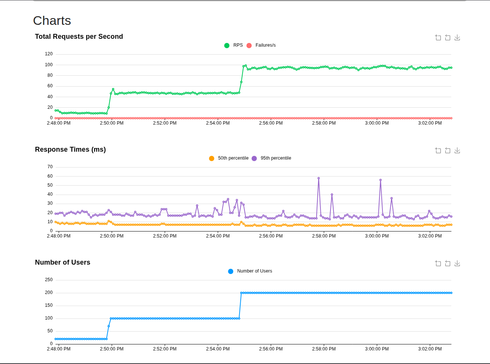

# Stockway

## Project Overview

Stockway is a modular monolithic backend platform designed to modernize rural supply chains. It connects Shopkeepers, Warehouses, and Delivery Riders through a unified, geospatially aware system. The platform facilitates order management, real-time inventory tracking, intelligent rider assignment, and automated payouts, solving the logistical challenges of last-mile delivery in underserved markets.

## Core Capabilities

*   **Role-Based Access Control**: Distinct inter-operating roles for Shopkeepers, Warehouse Managers, Riders, and Super Admins.
*   **Geospatial Intelligence**: Location-based warehousing and rider assignment using PostGIS.
*   **Order Lifecycle Management**: End-to-end tracking from order placement to final delivery and payment settlement.
*   **Real-Time Inventory**: Dynamic stock management across multiple warehouse locations.
*   **Automated Payouts**: Distance-based fee calculation and rider earning management.
*   **Secure Authentication**: OTP-based entry with strict permission enforcement.

## Architecture Summary

Stockway is built for reliability and scalability using a proven tech stack:

*   **Backend**: Python, Django, Django REST Framework (DRF)
*   **Frontend**: React, TypeScript, Material UI
*   **Database**: PostgreSQL with PostGIS extension (via Supabase)
*   **Authentication**: Supabase Auth (OTP/Password) + JWT
*   **Async Processing**: Redis and Celery for background tasks (analytics, notifications)

## System Roles

*   **Shopkeeper**: The primary customer; browses local inventories, places orders, and tracks incoming deliveries.
*   **Warehouse Manager**: The supply node; oversees stock levels, manages incoming orders, and monitors rider activity.
*   **Rider**: The logistics agent; receives proximity-based delivery tasks and earns based on successful fulfillments.
*   **Super Admin**: The platform overseer; manages all users, warehouses, and financial flows.

## API & Documentation

Comprehensive API documentation, including endpoint definitions and data models, is available at:

[**View API Documentation**](/docs_site/index.html)

*(Note: Ensure the local development server is running to access docs via the web interface at `/docs` if integrated, or view the static file directly.)*

## Local Development

To run the platform locally:

1.  **Backend**:
    *   Clone the repo and navigate to `backend/`.
    *   Create and activate a virtual environment.
    *   Install dependencies: `pip install -r requirements.txt`.
    *   Configure `.env` (database, auth keys).
    *   Run migrations: `python manage.py migrate`.
    *   Start server: `python manage.py runserver`.

2.  **Frontend**:
    *   Navigate to `frontend/`.
    *   Install dependencies: `npm install`.
    *   Start dev server: `npm run dev`.

## Load Testing

Stockway was load tested using [Locust](https://locust.io) with a staged ramp profile simulating realistic production traffic across all four user roles (Shopkeeper, Warehouse Manager, Rider, Admin).

### Test Profile
| Phase    | Users | Duration |
|----------|-------|----------|
| Warm-up  | 20    | 2 min    |
| Ramp     | 100   | 5 min    |
| Peak     | 200   | 8 min    |

### Results (Peak Phase — 200 concurrent users)
| Metric           | Value     |
|------------------|-----------|
| Total Requests   | 60,835    |
| Failures         | 0 (0.00%) |
| RPS              | 67.56     |
| p50 Latency      | 7ms       |
| p95 Latency      | 17ms      |
| p99 Latency      | 82ms      |
| Max Latency      | 328ms     |

## Project Status & Scope

**Current Status**: MVP (Minimum Viable Product)
**Scope**: The current release focuses on core API functionality, basic frontend flows for all roles, and essential logistics logic. Advanced features like predictive analytics, fleet routing optimization, and offline-first mobile capabilities are currently out of scope.

## License & Ownership

**Owner**: Granth Agarwal
**License**: MIT License. See [LICENSE](LICENSE) for details.

---

## Pre-Production Cleanup Checklist

Before deploying to a production environment, review and remove the following artifacts:

*   **Scripts**: `test_order_api.sh`, `create_test_order.py`, `load_test.js`, `verify_auth_migration.sh`, `apply_supabase_optimization.sh`
*   **Docs**: `flow.md`, `plans.md`, `GEMINI.md` (Internal guides), `WARP.md`
*   **Config**: Ensure `.env` contains production-grade secrets, not example values.
*   **Data**: Flush any test data generated by `create_test_order.py` from the primary database.
